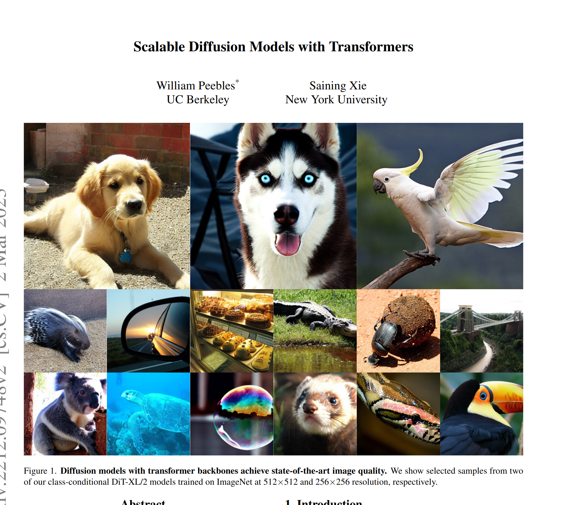

# Diffusion Transformer (DiT) fromScratch
Unofficial [LeetArxiv](https://leetarxiv.substack.com/p/the-annotated-diffusion-transformer) Implementation of the paper _Scalable Diffusion Models with Transformers_


*LeetArxiv is a successor to Papers with Code after the latter shutdown*. This paper's complete walkthrough is available [here](https://leetarxiv.substack.com/p/the-annotated-diffusion-transformer).

If you found this useful then we offer weekly, curated paper implementations on [Substack](https://leetarxiv.substack.com/p/the-annotated-diffusion-transformer).

## Paper Summary
The authors replace the U-net in a diffusion model with a MultiHead Attention Transformer. Complete walkthrough is available [here](https://leetarxiv.substack.com/p/the-annotated-diffusion-transformer).

I trained on CPU for 5 hours and got pretty decent results.


## Getting Started
```
Run the Jupyter Notebook. Only dependency is Pytorch to avoid Python installation hell lol.
```

You can find one saved model in the folder
```
models/
```

